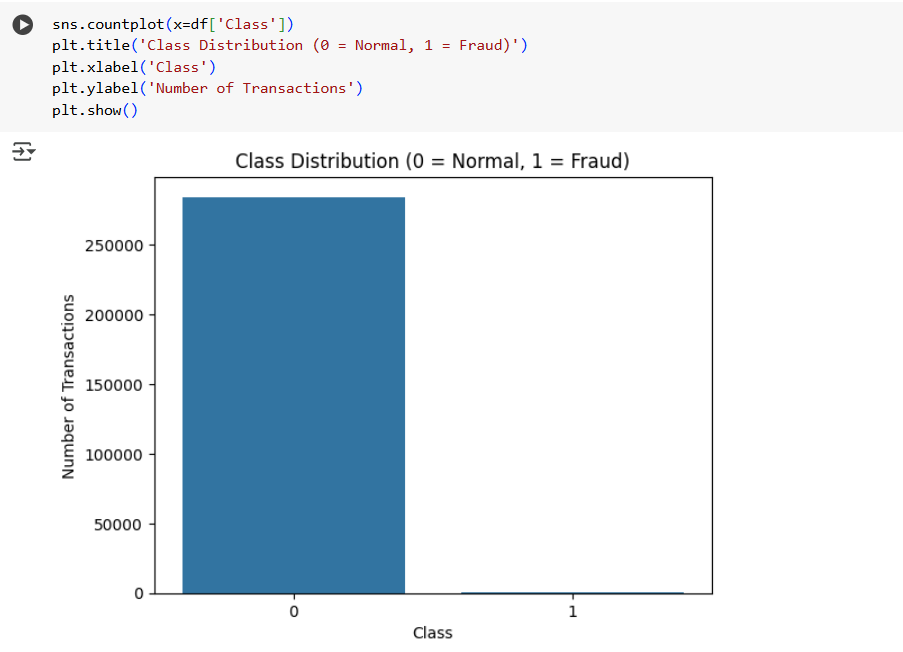
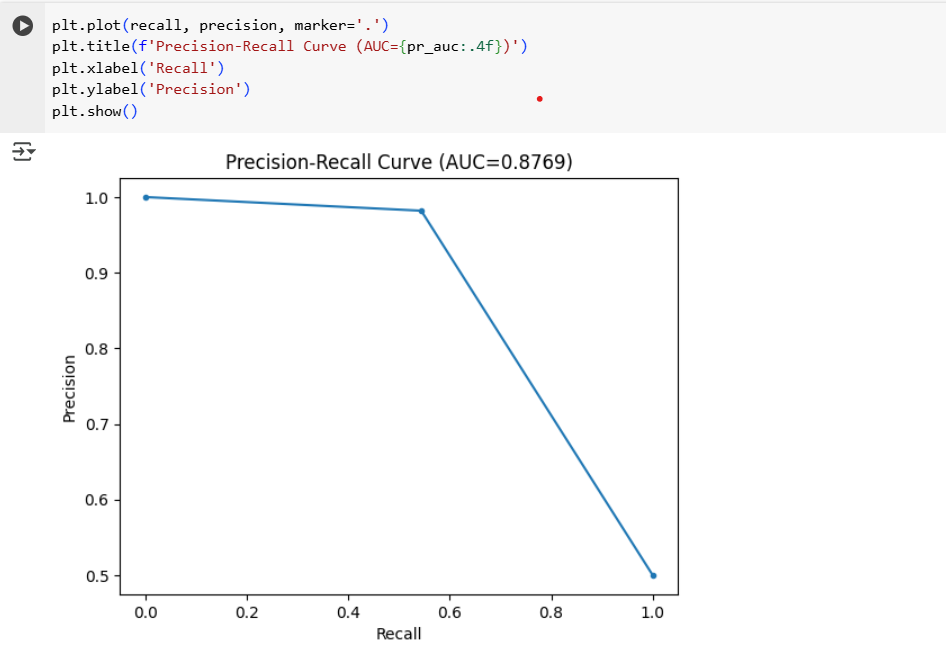

# Credit Card Fraud Detection
This project detects fraudulent credit card transactions using SMOTE for class balancing and Isolation Forest for anomaly detection.
## File
fraud_detection.py`: Python script with data loading, preprocessing, model training, and evaluation.
## Features
-Load and clean credit card transaction data
-Scale `Amount` column using StandardScaler
-Balance classes using SMOTE
-Train Isolation Forest on normal transactions
-Evaluate results using:
-Confusion Matrix
-ROC-AUC Score
-Precision-Recall Curve
## Visualizations
### Class Distribution

This plot shows how imbalanced the data is before applying SMOTE.
### Precision-Recall Curve

This curve evaluates the trade-off between precision and recall, important for fraud detection.
## Tools Used
- Python
- Pandas
- Matplotlib
- Seaborn
- Scikit-learn
- imbalanced-learn (SMOTE)

